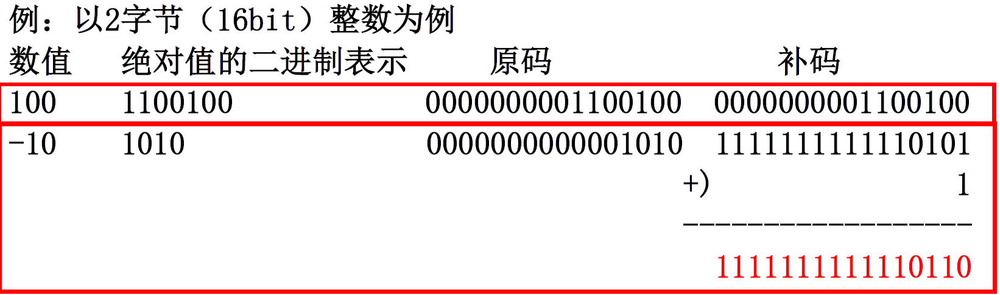
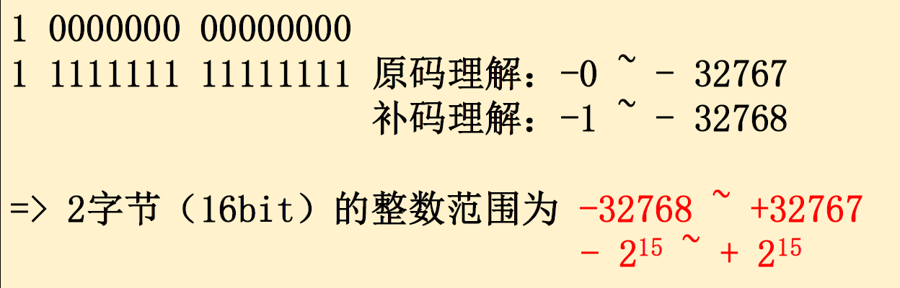

1.我们知道,C++中的所有整数都是由0和1构成的.

2.对于无符号正整数: 二进制值是多少就是多少.

例:

```
0010: 为2
0101: 为5
```

3.负整数: 怎么办？

计算机学家发明了补码:

A.首位表示正负: 

```
1xxx: 代表负数
```

B.具体数值: 

-10&rarr;补码:

流程: 绝对值原码取反再加1.




补码&rarr;-10:

流程: 取反再加1,再乘一个负号.(见上图)

4.由此可得16位short的范围:


分开讨论.

