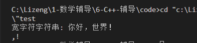

1.wchar_t: 解决ASCII码无法表示中文字符的问题.

2.wchar_t代码示例:

```
#include <stdio.h>
#include <wchar.h>
#include <locale.h>

int main(void){
	// 设置本地化环境以支持宽字符输出
    setlocale(LC_ALL, "");

    // 定义一个宽字符字符串
    wchar_t wstr[] = L"你好，世界！";

    // 输出宽字符字符串
    wprintf(L"宽字符字符串: %ls\n", wstr);
    
    // 定义一个char类型字符串
    char str[] = "你好,世界!";
    
    // 尝试输出
    printf("%s",str);
}
```

3.最终输出:



